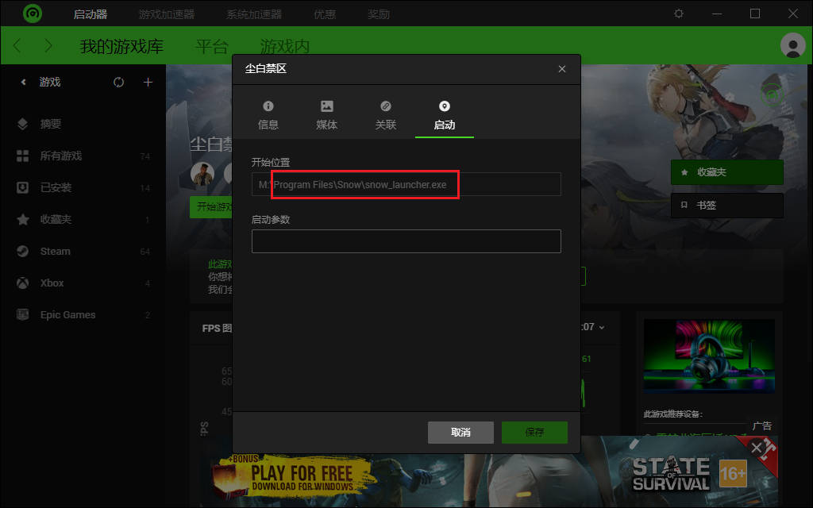

# 《尘白禁区》服务器切换器

简介：此程序用于切换不同渠道的启动器，以连接到不同的《尘白禁区》服务器。

> 自尘白一周年开始，lhm启用了西山居尘白启动器，新用户下载到的不是旧版的尘白启动器。截止至2024年8月15日，西山居启动器存在诸多问题，包括缩放错误、闪退、蓝屏、无法开机（收集自启动器交流群群友自述内容）。因此，推荐暂时使用旧版启动器v2.0（群友说已经更新不了了）。
>
> 旧版启动器下载链接：[跳转至v1.2.2发行](https://github.com/LiuJiewenTT/Snowbreak_ServerSwitcher/releases/tag/v1.2.2)

快速跳转：[使用](#使用), [配置方法](#配置方法), [GUI](#guis)，[一键启动](#一键启动).


项目地址：<https://github.com/LiuJiewenTT/Snowbreak_ServerSwitcher><br/>
说明页链接：<https://liujiewentt.github.io/Snowbreak_ServerSwitcher/README><br/>下载请到Release区：<https://github.com/LiuJiewenTT/Snowbreak_ServerSwitcher/releases><br />视频教程：

- [尘白禁区切服器-特点一览](https://www.bilibili.com/video/BV1rH4y1u7Zh/)
- [尘白禁区切服器 - 安装及美化](https://www.bilibili.com/video/BV1sE421F7m3/)
- [尘白禁区切服器 - 使用演示 - 技术演示版](https://www.bilibili.com/video/BV1Wt421T7GP/)
- [尘白禁区切服器 - 添加测试服](https://www.bilibili.com/video/BV1Nx4y1p7us/)


如果有bug欢迎反馈！[到这里来添加 *Issue*](https://github.com/LiuJiewenTT/Snowbreak_ServerSwitcher/issues)<br/>参与更多讨论可以来 [*Discussions *区](https://github.com/LiuJiewenTT/Snowbreak_ServerSwitcher/discussions)

## 可行性分析

已知：

1. 启动器名称没有任何影响，可以自己修改，不同启动器可以共存。
2. 官服和B服共用相同的数据，仅启动器不同。
3. 已有工具基于以上原理实现了切换。
4. 符号链接通常对程序透明。
5. 已测试：启动器名称不会被更新改变。

故：

1. 可以使用符号链接实现共存和替换，但最后共用**同一入口**。
2. 可以正常更新启动器。

## 优势

在2023年7月开服时，已经有人用易语言制作了一个启动器。

后来，西山居更新了启动器（发布1.1版本“夏日过年”时），这意味着各个渠道的启动器都要更新。（事实上，后来每个大版本更新都要更新启动器。）

> 使用符号链接的好处在于，如果直接访问，那么链接是透明的，程序直接访问真实文件。

本程序使用Windows系统下运行于`cmd.exe`（命令提示符）的`.bat`批处理脚本实现。代码开放，完全开源，安全可查。

> - 非易语言程序，不会被杀毒软件误杀（360，仅未知程序运行提醒），放心使用。
> - 非powershell脚本(.ps1)，没有麻烦。
> - 没有高危操作，不需要管理员权限启动。（但启动启动器时，启动器会要求管理员权限。此提权请求与本程序无关。）
>
>   > 自`v1.2.1`起，也可以使用管理员权限启动，这样后续不再需要UAC确认了。
> - 支持国服国际服切换！（资源版本不同无法共用资源，仅能共用入口）
> - 预留**扩展槽可供测试服**使用！

> 如果不放心担心被其它程序或其它人修改程序产生不良影响，可以在【属性】->【安全】删除普通用户“写入”权限、保留“执行”权限。

<strong style= "color:red"> 此外，在游戏目录内（启动器原始位置），不同渠道的启动器可以共用相同的文件名。</strong>也就是说，如果你不是一起开那么一个桌面快捷方式就足够了。（此时也不用担心更新可能出现混乱导致快捷方式或是其它程序（如，Razor Cortex）出现路径错误。）

> 本切服器已确认适配了一些软件和文件形式：
>
> - “桌面快捷方式”(在win10测试，可用但不显示图标)。
> - *Razor Cortex (雷游)*
> - Live2DViewerEx （小部件“桌面图标”已适配完美）
>
> 
>
> 例：`M:\Program Files\Snow\snow_launcher.exe`（这将会是一个符号链接，三服都可以共用这个入口，雷游这样的程序也不需要添加多个服务器的启动器，一次就好。）

当然，如果你就是要多个一起开，那，如果可以的话，本程序应该也可以满足你。可惜，启动器似乎进行了限制，不允许多开。

> 具体什么问题可以联系作者，有空会协助解决。

## 备注

1. 双语特性：支持中文（保证不乱码）和英文。（Support zh_CN and en_US.）
2. 暂未添加游戏语言配置文件链接。（预计下版本添加）

## 使用

> 首次启动前需要完成配置，具体看[下一部分](#配置方法)说明。

命令格式：

``` bat
CBJQ_SS.main [OPTIONS] [SERVER]
```

完成配置后，可使用[<strong style="color:red">GUI</strong>](#guis)进行操作。

### 注意事项

你的当前账户可能不被允许创建“文件符号链接”(symlink)，请到设置中打开开发者模式。

*补充说明：请确保真正的启动器所在目录下有`preference.json`文件，如果没有这个文件，启动器会以为是第一次运行，进而无法定位到正确的游戏数据目录。*

运行环境注意（普通玩家）
1. 使用前请确认“用户变量设定区”的已经设置好了启动器路径。
2. 除了“用户变量设定区”，其它都不要动。
3. 请确保路径中不包含这些符号：“`[` `]`”

运行环境注意（高级玩家）
1. 从Powershell启动可能会存在`LANG`环境变量，程序将优先从`LANG`选择`mLANG`缺省值。
2. 启动参数必须选项在前服务器在后，指定多个服务器会依次触发操作。
3. 上部分第三点具体说明：目的路径字符串不得包含启动器储存路径字符串。

<small>不要乱改，没允许改的地方小白就不要碰了，你可知从`v1.0.1`到`v1.1.0`就一个主要功能更新在功能完成后还出现了7次修复bug提交吗？如果没那么小心，bug数量一定是两位数。所以，**不要乱改没让改的区域！！！**</small>

### 参数

**启动参数必须选项在前服务器在后，指定多个服务器会依次触发操作。**

1. `-nopause`：从命令行启动可以指定该参数，使得程序结束时不暂停。
2. **`-nostart`**：**仅切换**启动器，**不顺带启动**程序。
3. `-noswitch`：**仅启动**程序，**不切换**启动器。

程序已经根据当前情况预设好了三种服务器（名）：

1. `worldwide`：国际服
2. `bilibili`：B服
3. `kingsoft`（金山）：官服

例1：

``` bat
CBJQ_SS.main bilibili
```

例2：

``` bat
CBJQ_SS.main.bat bilibili
```

例3：

``` bat
CBJQ_SS.main.bat -nostart bilibili
```

例4：

``` bat
CBJQ_SS.main.bat -nostart slot1
```

> `slot1`是自带的示例预留扩展槽的昵称（"*nickname*"）。

例5：

``` bat
CBJQ_SS.main.bat -nostart -nopause bilibili
```

例6：

```bat
CBJQ_SS.main.bat -noswitch -nopause bilibili
```

例7（没什么意义）：

``` bat
CBJQ_SS.main.bat -nostart -nopause bilibili kingsoft worldwide
```

## 配置方法

> 请按照[注意事项](#注意事项)和脚本内的说明进行配置。
>
> **国际服的适配**<del>还在开发中，请暂时不要使用。</del><del>**默认支持，没有什么特殊的地方，只是不能和国服共用资源、启动器和启动器配置文件。**<br/>“要重装系统”是胡扯，“要重下资源”倒是有可能需要“2+1”次（详细原因见如下步骤4）。</del>罪魁祸首已经被我揪出来了，<del>请等待后续措施。</del>**`v1.1.0`版已通过适配测试。**更多信息：<br/>
> 探究实践日志见：[日志](国际服兼容研究/国际服兼容研究.md)。

**请在安装好一个版本后开始配置**。(推荐优先国服)

> 以下为示例，看得懂的可以自行配置。

1. 选择一个位置，比如启动器所在的位置。例如：`M:\Program Files\Snow\`。

2. 将发行的压缩包内的文件夹`Snowbreak_ServerSwitcher`解压到这个位置。

3. 把原启动器拖入：`Snowbreak_ServerSwitcher\Launchers\`文件夹内。

   > 如果是国际服，可以考虑使用此示例：`Snowbreak_ServerSwitcher\Launchers\worldwide\`。

4. 把原启动器所在目录下的`preference.json`复制到启动器新位置。

   > 补充说明：
   >
   > 1. 请确保真正的启动器所在目录下有`preference.json`文件，如果没有这个文件，启动器会以为是第一次运行，进而无法定位到正确的游戏数据目录。
   >
   > 2. 国际服默认不可与国服共用文件，所以（简单的说最简单的办法是）您应该安装在其它位置，使用的`preference.json`也同样不能与国服的共用。
   >
   >    > 启动器也不是非要放在另外的安装位置，只要和国服<u>*不在同一目录即可*</u>, 详细方法如下：
   >    >
   >    > ​	更改`preference.json`中资源储存位置`dataPath`，无此文件直接启动可能导致当处于同一目录时属于国服的`data\manifest.json`被覆写而使国服需要重新下载资源。非要装在一起，请先设置好国际服的`preference.json`或备份一下国服的`manifest.json`。
   >    
   > 3. 同大类（国际服/国服）同版本是共用资源的基础，而**国服正式版和国服测试版资源版本不同**，所以不能完全共用。（想啥呢，要是都一样，只是新增没有修改，那是玩笑！）
   >    
   >    > 所以如果差异不大，没关系共用资源，差异部分让它重新下载就行了（或者自己修改`manifest.json`）；
   >    > 如果大或者单纯不想折腾，打算分开装，请把它当国际服一样配置（除了切服器的对应localization要为`homeland`）。

5. 把你要的其它渠道的安装包（如：`CBJQ_Setup.exe`）用解压软件打开，打开`app.7z`（压缩包内的压缩包）。

6. 将里面的启动器复制到刚才那个启动器的新位置去，把它们放到一起（同一目录）（<strong style="color:red">国际服启动器不要和国服启动器放同一目录下！！！测试服也是！</strong>）。

7. 给不同启动器重命名。

8. 来到脚本`Snowbreak_ServerSwitcher\CBJQ_SS.main.bat`中的“用户变量设定区”，设置说明了的*6个*变量。（没有就设为`%launcher_none%`）

   > `launcher_worldwide`, `launcher_bilibili`, `launcher_kingsoft`；（没有就设为`%launcher_none%`）<br/>
   > `launcher_worldwide_dest`, `launcher_bilibili_dest`, `launcher_kingsoft_dest`。（目的位置，就是原本应该在的路径）

   **首尾不要有多余的空格！**储存路径建议使用绝对路径而非相对路径。若移动了储存路径，可能会错误识别未存在，尝试切换或删除目的文件即可解决。目的目录必须存在，程序不会自动创建缺失的目录。**示例**：

   ``` bat
   @set launcher_worldwide=%~dp0Launchers\worldwide\snow_launcher-worldwide.exe
   @set launcher_bilibili=%~dp0Launchers\snow_launcher-bilibili.exe
   @set launcher_kingsoft=%~dp0Launchers\snow_launcher-kingsoft.exe
   
   @set launcher_worldwide_dest=..\snow_launcher.exe
   @set launcher_bilibili_dest=..\snow_launcher.exe
   @set launcher_kingsoft_dest=..\snow_launcher.exe
   ```

   （**预留扩展槽的配置方法**同理，在“用户区”内，额外的一个必要项就是“*nickname*”，启动时是按照它来匹配的。对应的对国际服的兼容项为“*localization*”，只能在`homeland`和`worldwide`之间选择。如果是这段时间的国服测试服，那么用自带的扩展槽位配置即可：把启动器放到合适位置并重命名。）

   不会改参数就按这里的命名，然后复制这一段将对应代码替换。

   > 如果你既玩国服又玩国际服，请参照配置后续几行：
   >
   > ``` bat
   > @set StartupSettingsName_homeland=startup-homeland.settings
   > @set StartupSettingsName_worldwide=startup-worldwide.settings
   > ```
   >
   > 如果不是，这样即可：
   >
   > ``` bat
   > @REM @set StartupSettingsName_homeland=startup-homeland.settings
   > @REM @set StartupSettingsName_worldwide=startup-worldwide.settings
   > ```
   >
   > 即，在行首添加`@REM`注释掉命令使之不生效即可。如果用过上面的，配置且运行通过后，不想重新生成`startup.settings`（虽然无所谓），那只注释一个并留下自己要用的那个即可。
   >
   > > <del>启用但不存在实际启动配置文件的话，启动会被终止。解决方法是停用（即注释掉）对应的命令，然后启动，完成登录和选服，可以尝试进入游戏，退出游戏后将启动配置文件重命名成命令中的名字即可。</del>（启动器也要退出。）

9. 使用命令行按照上述参数示例启动/切换启动器；或使用[<strong style="color:red">GUI</strong>](#guis)操作；或直接使用<strong style="color:red"><a href="#一键启动">一键启动</a></strong>程序。

   > 也可以用配置好的几个文件，给这几个文件创好桌面快捷方式，然后双击启动：
   >
   > - 切换+启动：`尘白禁区**（切换+启动）.bat`
   > - 仅切换，不自动启动：`尘白禁区**（切换）.bat`
   > - 仅启动，不切换：`尘白禁区**（启动）.bat`
   >
   > 您也可以为测试服配置启动脚本！
   
   > 配置**GUI** (CBJQ_SS_FrontEnd-tk)时您可以使用如下方式完成cwd参数和配置文件的**初始化**：
   >
   > 1. 运行cmd（命令行）。（`Win`+`R`，输入`cmd`，回车）
   >
   > 2. 转到GUI程序所在目录，示例：`cd /d "M:\Program Files\Snow\Snowbreak_ServerSwitcher\GUIs\CBJQ_SS_FrontEnd_tk-B-I2\CBJQ_SS_FrontEnd_tk-B-I2"`
   >
   > 3. 把`Snowbreak_ServerSwitcher`的完整路径作为启动参数传入，示例：
   >
   >    ``` shell
   >    M:\Program Files\Snow\Snowbreak_ServerSwitcher\GUIs\CBJQ_SS_FrontEnd_tk-B-I2\CBJQ_SS_FrontEnd_tk-B-I2> CBJQ_SS_FrontEnd_tk-B-I2.exe -cwd "M:\Program Files\Snow\Snowbreak_ServerSwitcher"
   >    ```
   >
   > 4. 关闭弹出的图形窗口，配置得到保存。（如果有启动页，进入）

## GUIs

可用GUI程序：

1. 项目：[CBJQ_SS_FrontEnd-tk](https://github.com/LiuJiewenTT/CBJQ_SS_FrontEnd-tk)。（目前仅支持中文）

## 一键启动

可用。使用对应的 *CBJQ_SS.QS.\*.exe*即可，如双击打开、桌面快捷方式。

发行包应已存在`CBJQ_SS.QS.exe`，重命名即可。例如：`CBJQ_SS.QS.kingsoft.exe`。

详见项目页：<https://github.com/LiuJiewenTT/CBJQ_SS.QS>

## LICENSE

本项目遵循MIT开源协议。

本项目含子项目[`CBJQ_SS.StartWrapper` (`.\startwrapper`)](https://github.com/LiuJiewenTT/CBJQ_SS.StartWrapper)（MIT开源协议）实现管理员权限下符号链接解析，以确保使用的配置文件正确。构建产品应存储在`main`所在目录；

本项目含子项目[`CBJQ_SS.QS` (`.\quickstart`)](https://github.com/LiuJiewenTT/CBJQ_SS.QS)（MIT开源协议）实现一键切换并启动。构建产品推荐在`main`所在目录使用；

本项目内置[`IconFold` `v1.0.0` (`.\tools\IconFold\v1.0.0`)](https://github.com/LiuJiewenTT/IconFold) （MIT开源协议）实现文件夹图标的设置。可以删除tools文件夹。

## Copyrights

此部分主要是关于资源的版权声明。（排序不分先后）

| 资源位置           | 版权所有者                                   | 备注 |
| ------------------ | -------------------------------------------- | ---- |
| 辰星-云篆 团子.jpg | *魔法少女鱼鱼熏Kaori* (B站用户UID: 66874794) |      |

